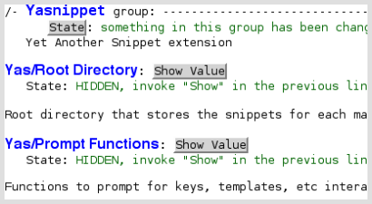

=============================
Yet Another Snippet extension
=============================

:Author: pluskid
:Contact: pluskid@gmail.com
:Date: 2008-03-20

.. contents::

Yasnippet is a template system for emacs. It allows you to type a
abbrevation and automatically expand the abbreviation into function
templates.

Bundled language templates includes: C, C++, C#, Perl, Python, Ruby,
SQL, LaTeX, HTML, CSS and more.

Yasnippet system is inspired from TextMate's template system. You can
use `a tool
<https://groups.google.com/group/smart-snippet/browse_thread/thread/691fbdd33412d86e?pli=1>`_
to import any TextMate template you have to Yasnippet. It is a
re-design and re-write of my original extension `smart-snippet`_. It
is much cleaner and more powerful than smart-snippet.

.. _smart-snippet: http://code.google.com/p/smart-snippet/

Video Demo
==========

Watch the `demo at YouTube
<http://www.youtube.com/watch?v=vOj7btx3ATg>`_ (download a higher
resolution version: `yasnippet.avi
<http://yasnippet.googlecode.com/files/yasnippet.avi>`_).

Brief Install Instruction
=========================

There are two archives of YASnippet. One is a single file compiled
“bundle”, and the other is normal. If all you need is to use the
builtin templates, download the bundle one. If you want to add your
own templates, download the normal one.

Bundle Install
--------------

1. Download the latest ``yasnippet-bundle-x.y.z.el.tgz`` and unpack it.
2. You'll get a file named ``yasnippet-bundle.el``, put it under
   ``~/.emacs.d/plugins/`` (create the directory if not exists).
3. Open the file in Emacs, and type ``Alt+x eval-buffer``.

That's it. Now open any one of your language file, you'll see a menu
YASnippet. you can pull the menu to insert a template. Or, you can
type the pre-defined abbrev and press ``TAB`` to expand it.

To have emacs load YASnippet automatically when it starts, put the
following in your ``~/.emacs`` file:

   .. sourcecode:: common-lisp

     (add-to-list 'load-path
                   "~/.emacs.d/plugins")
     (require 'yasnippet-bundle)

Normal Install
--------------

For full install of the normal archive, just download and unpack the
latest ``yasnippet-x.y.z.tar.bz2``. You'll get a directory named
``yasnippet``, put it in your ``~/.emacs.d/plugins`` and add the
following in your ``.emacs`` file:

   .. sourcecode:: common-lisp

     (add-to-list 'load-path
                   "~/.emacs.d/plugins")
     (require 'yasnippet) ;; not yasnippet-bundle
     (yas/initialize)
     (yas/load-directory "~/.emacs.d/plugins/yasnippet/snippets")

Please refer to the documentation for full customization, or use the
customization group.

Customization group
===================

From version 0.6 onwards, there is a customization group that you can
access with:

``M-x customize-group RET yasnippet RET``

Each customization variable affects how some part of YASnippet works,
for example automatic snippet indentation, what prompting method to
use, whether to expand snippets inside snippets, etc...

Inside the customization group, each variable is reasonably documented
to explain what it does.

Bugs, Contribution and Support
==============================

* If you find a bug, please report it at `Issue List
  <http://code.google.com/p/yasnippet/issues/list>`_.
* If you have problem using YASnippet, or have some new ideas, please
  post to the `discussion group`_. Especially, there's a `wish list`_
  wiki page. I'll collect ideas from the `discussion group`_ to the
  `wish list`_. So you might want to look at the `wish list`_ before
  you post something.
* If you want to contribute some snippets, you can also post them to
  the `discussion group`_. Some common snippets may be added to
  YASnippet, while others will be collected at the
  `UserContributedSnippets wiki page
  <http://code.google.com/p/yasnippet/wiki/UserContributedSnippets>`_.

.. _discussion group: http://groups.google.com/group/smart-snippet
.. _wish list: http://code.google.com/p/yasnippet/wiki/WishList

Thank you very much for using YASnippet!
